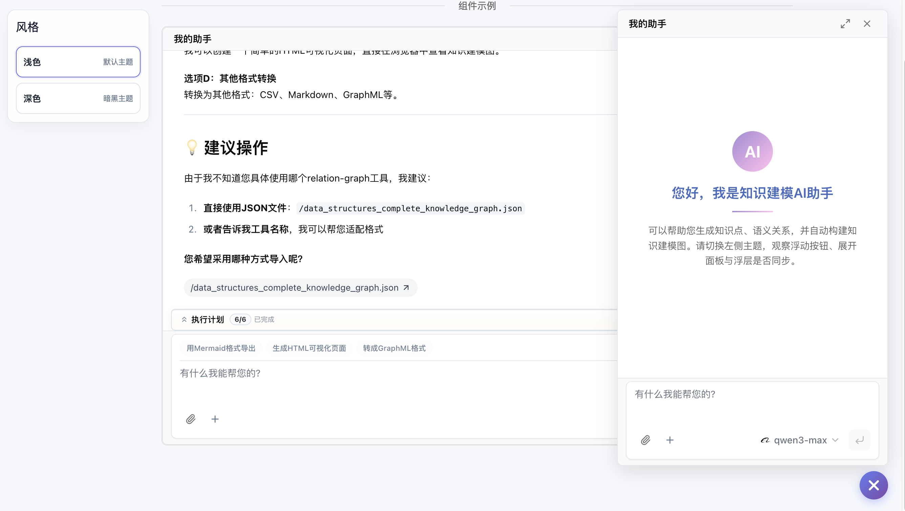

# LangGraph Vue3 Chatbot

基于 Vue 3 + LangGraph 的 AI 悬浮对话组件，方便在业务系统中快速集成 Agent 智能体框架。

## 简介

`AskAiBot` 是一个可悬浮的 AI 对话组件，专门用于对接 LangGraph 后端 API。它不是一个完整的应用，而是一个**可集成的 Vue 3 组件**，只需几行代码即可将 AI 对话能力接入现有业务系统。

## 功能特性

- 悬浮式对话界面，可展开/收起
- 基于 `@langchain/langgraph-sdk` 实现流式响应
- 支持工具调用展示（Sandbox 组件）
- 模块化组件设计
- Markdown 渲染性能优化

## 技术栈

- **前端框架**: Vue 3 (Composition API + `<script setup>`)
- **构建工具**: Vite
- **样式**: Tailwind CSS v4
- **AI SDK**: @langchain/langgraph-sdk, ai
- **UI 组件**: ai-elements-vue, reka-ui (基于 shadcn-vue)
- **Markdown**: markstream-vue

## 快速开始

### 安装依赖

```bash
pnpm install
```

### 开发模式

```bash
pnpm dev
```

### 构建生产版本

```bash
pnpm build
```

## 使用示例

### 在业务系统中集成

```vue
<script setup>
import AskAiBot from './components/ai-bot/AskAiBot.vue'
</script>

<template>
  <div>
    <!-- 其他业务内容 -->
    <AskAiBot
      assistant-id="your-assistant-id"
      assistant-name="AI 助手"
      :default-expanded="false"
    />
  </div>
</template>
```

### 组件效果



## 项目结构

```
src/
├── components/
│   ├── ai-bot/
│   │   ├── AskAiBot.vue          # 悬浮聊天组件（核心）
│   │   ├── ChatBot.vue        # 聊天主组件
│   │   ├── ChatMessages.vue   # 消息列表组件
│   │   ├── ChatInput.vue      # 输入框组件
│   │   ├── ChatHeader.vue     # 头部组件
│   │   ├── ToolCall.vue       # 工具调用组件
│   │   ├── GeneratedFiles.vue # 自定义文件消息展示
│   │   ├── lib/               # 类型与请求辅助
│   │   ├── ai-elements/       # 对话 UI 基础组件
│   │   └── ui/                # 通用 UI 组件封装
└── App.vue                    # 应用入口
```

## 核心组件

### AskAiBot.vue

核心悬浮聊天组件，特性：

- 内部组合 `ChatBot.vue` 与悬浮按钮
- 支持流式响应 (stream)
- 支持展开、收起、最大化与拖拽调整宽度
- 使用 `thread` 管理对话上下文

### API 集成

组件通过 `@langchain/langgraph-sdk` 直接连接 LangGraph 后端：
- 默认地址：`http://localhost:2024`
- 可通过 `VITE_LANGGRAPH_API_URL` 和 `VITE_LANGGRAPH_API_KEY` 配置

## 配置

### 环境变量

在 `.env.development` 或 `.env.production` 中配置：

```
VITE_LANGGRAPH_API_URL=http://localhost:2024
VITE_LANGGRAPH_API_KEY=your-api-key
```

### LangGraph 后端地址

可通过组件属性或环境变量传入：

```typescript
<AskAiBot
  api-url="http://localhost:2024"
  api-key="your-api-key"
/>
```

## 许可证

MIT
